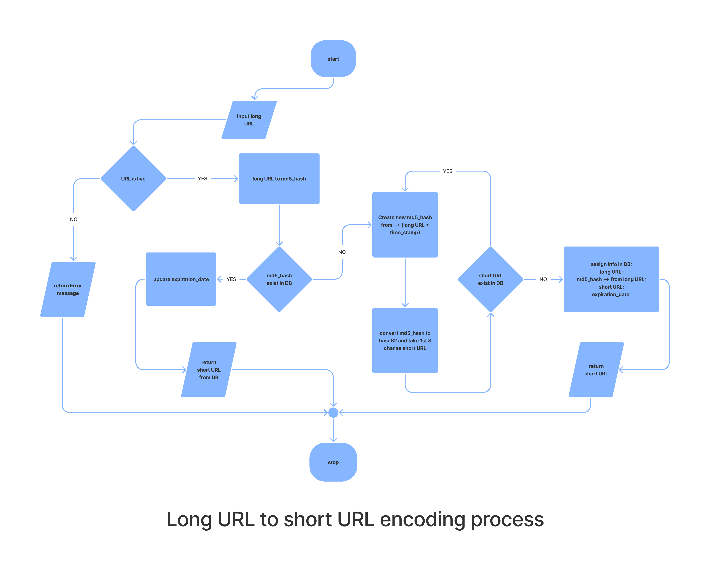

# ✨ url-shortener 💫
_Django based URL Shortener web application_

<div align="center">
  
</div>
<br>

### How to Contribute to this repository

* Fork the repository (Click the Fork button in the top right of this page, click your Profile Image)
* Clone the forked repository to your local machine.
```markdown
git clone https://github.com/YOUR-GITHUB-USERNAME/url-shortener.git
```
* change the present working directory
```markdown
cd url-shortener
```
* Make a new branch
```markdown
git checkout -b branch-name
```
* Project Setup
```markdown
python -m venv env       # create virtual env
source env/bin/activate  # active env
pip install -r requirements.txt # install packages
python manage.py runserver # runserver
```
Open browser at --> http://127.0.0.1:8000/
* Make change in the repository with the new branch.
* push the changes.
```markdown
git add -A
git commit -m "Your commit Message"
git push origin branch-name
```
* Make a pull request to the dev branch.
* Star the repository.

### NOTE

* Make Sure you commit your changes in a new branch.
* Make Sure you Give proper name to your files describing the addition.
* Also Make Sure you comment your code wherever necessary.
* Give PR to the dev branch 

   
<!--       END OF README           END OF README         END OF README         END OF README          END OF README           END OF README           END OF README      -->

